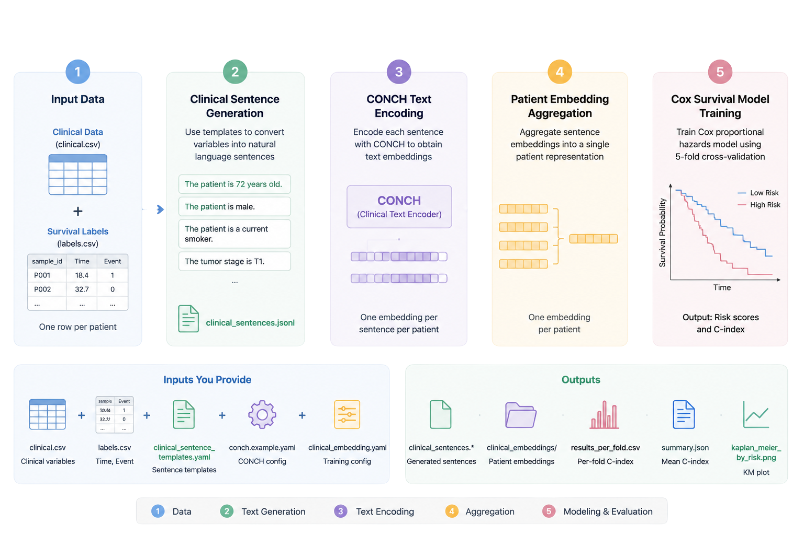

# Clinical Text Survival Pipeline

Generate clinical text embeddings from structured clinical variables using **CONCH** and train a **Cox proportional hazards model** for recurrence risk prediction.

<p align="center">
  
</p>

## Pipeline

```text
Clinical CSV
      +
Survival Labels
      │
      ▼
Clinical Sentence Templates
      │
      ▼
CONCH Text Encoder
      │
      ▼
Patient Embeddings
      │
      ▼
Cox Survival Model
      │
      ▼
C-index + Risk Scores + Kaplan-Meier Plot
```

---

## Features

- Convert structured clinical variables into natural-language sentences
- Generate patient-level clinical text embeddings with CONCH
- Train a Cox survival model using 5-fold cross-validation
- Report per-fold and mean C-index
- Generate Kaplan-Meier risk stratification plots

---

## Installation

Clone the repository:

```bash
git clone https://github.com/SaHashemii/clinical-text-survival.git
cd clinical-text-survival
```

Create a Conda environment:

```bash
conda create -n clinical-text-survival python=3.10
conda activate clinical-text-survival
pip install -e .
```

Install CONCH in the same environment:

```bash
git clone https://github.com/mahmoodlab/CONCH.git ../CONCH
pip install -e ../CONCH
```

Download the CONCH checkpoint and place it at

```text
../CONCH/checkpoints/conch/pytorch_model.bin
```

---

## Required Inputs

| File | Description |
|------|-------------|
| `clinical.csv` | Structured clinical variables (one row per patient) |
| `labels.csv` | Survival labels (`sample_id`, `Time`, `Event`) |
| `clinical_sentence_templates.yaml` | Converts variables into clinical sentences |
| `conch.example.yaml` | CONCH encoder configuration |
| `clinical_embedding.yaml` | Survival model configuration |

The default sentence template expects the following clinical variables:

```text
sample_id
age
sex
smoking
tumor
stage
substage
grade
reTUR
LVI
variant
EORTC
no_instillations
BRS
```

---

## Run

Execute the complete pipeline with a single command:

```bash
python scripts/run_clinical_text_survival.py \
    --clinical /path/to/clinical.csv \
    --labels /path/to/labels.csv \
    --templates configs/text/clinical_sentence_templates.yaml \
    --encoder configs/encoders/conch.example.yaml \
    --experiment configs/experiments/clinical_embedding.yaml \
    --output-dir outputs/clinical_text_conch
```

To reuse previously generated CONCH embeddings:

```bash
--reuse-embeddings
```

For a quick one-fold test:

```bash
--fold 0
```

---

## Outputs

```text
outputs/
├── clinical_sentences.csv
├── clinical_sentences.jsonl
├── clinical_embeddings/
├── fold_0/
├── fold_1/
├── ...
├── results_per_fold.csv
├── summary.json
├── test_risk_scores_all_folds.csv
└── kaplan_meier_by_risk.png
```

| Output | Description |
|---------|-------------|
| `summary.json` | Mean cross-validation C-index |
| `results_per_fold.csv` | Per-fold performance |
| `clinical_embeddings/` | Patient embedding files |
| `kaplan_meier_by_risk.png` | Kaplan-Meier risk stratification |

---

## Repository Structure

```text
configs/
scripts/
clinical_survival/
outputs/
```

The main pipeline internally performs three steps:

1. Generate clinical sentences
2. Encode them with CONCH
3. Train the survival model


---

## Acknowledgements

This repository uses the **CONCH** foundation model from Mahmood Lab for clinical text encoding.
